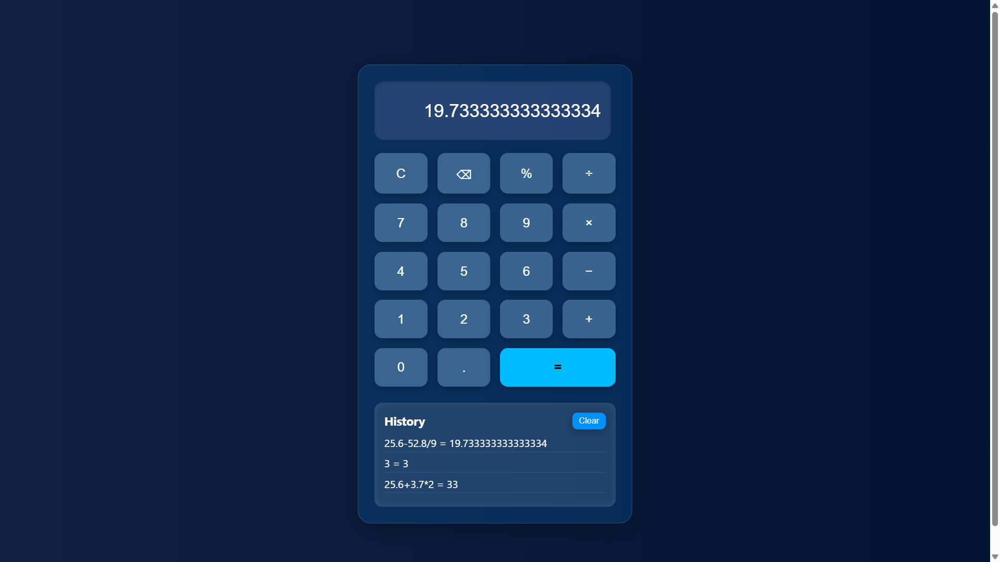

## 🚀 Task: Responsive Calculator Web App 🧮💙

This is one of my internship projects developed as part of the **Python/Full Stack Web Development Internship** at **CodSoft**.
It is a fully functional, modern **web calculator** built using **Flask, HTML, CSS, and JavaScript**.

---

## 🎯 Objective

To build a real-style calculator with:

* 💡 Support for float values and full arithmetic operations
* 🧊 Blue-themed **glassmorphic UI design**
* 📱 Responsive layout for mobile and desktop
* 📜 Dynamic **calculation history** with Clear feature
* 🧠 JavaScript-based logic and display updates

---

## 🛠️ Tech Stack

* **Frontend**: HTML, CSS (responsive & themed), JavaScript
* **Backend**: Python (Flask)
* **Tools**: VS Code, Flask Server, Browser Developer Tools

---

## 🖥️ Project Preview

| Desktop View                                                            | Mobile View                                                           |
| ----------------------------------------------------------------------- | --------------------------------------------------------------------- |
|                                                  |  |

---

## 📁 File Structure

```
calculator-web/
├── app.py                 # Flask app
├── templates/
│   └── index.html         # Calculator UI
├── static/
│   ├── style.css          # Glassy blue theme + responsiveness
│   └── script.js          # JS logic for display, history, operations
```

---

## ▶️ How to Run

> ✅ Make sure Python & Flask are installed.

```bash
git clone https://github.com/your-username/calculator-web.git
cd calculator-web
pip install flask
python app.py
```

Open your browser and go to:
`http://127.0.0.1:5000`

---

## 💻 Features

* 🔢 Handles `+`, `−`, `×`, `÷`, `%`, decimals
* 📲 Responsive mobile layout
* 💙 Blue pastel theme with glass effect
* 📜 Scrollable calculation **history panel**
* ❌ Clear history option
* ⚡ Instant evaluation using `eval()` in JS

---

## 📌 Internship Tag

> 🏷️ `#CodSoftInternship` `#PythonDevelopment` `#FlaskWebApp`

---